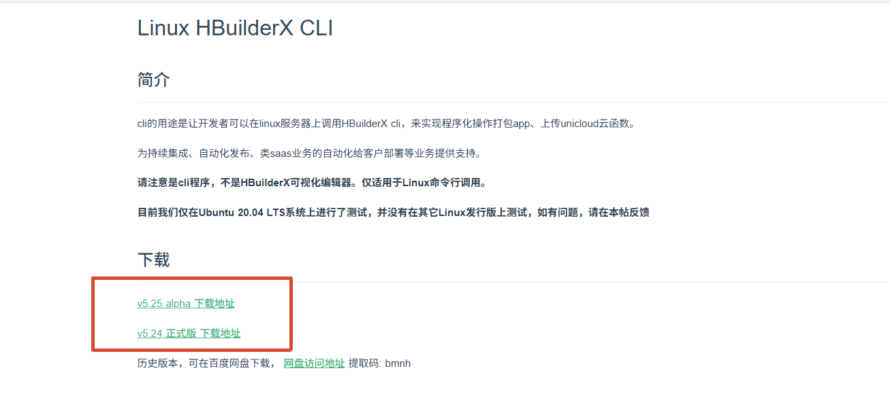
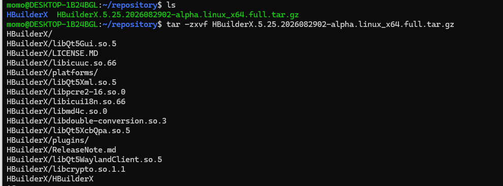
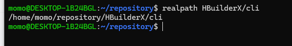
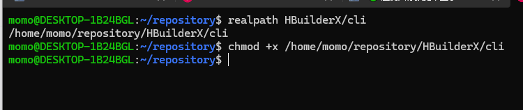
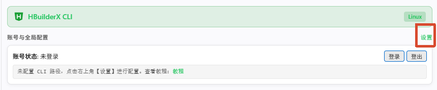
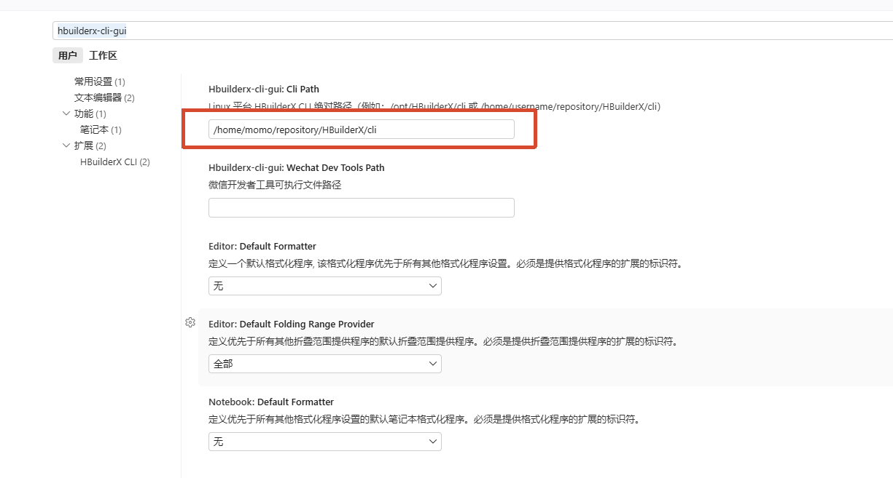
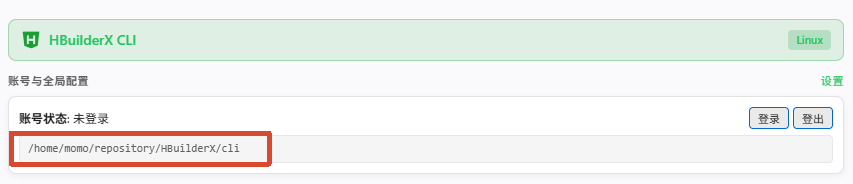

# HBuilderX Linux CLI 安装与配置教程

欢迎使用 **HBuilderX CLI GUI** 扩展！通过本教程，您可以在 Linux 环境中快速安装 HBuilderX Linux CLI 并接入 VS Code。

---

## 1. 下载 HBuilderX Linux 软件包
https://hx.dcloud.net.cn/Tutorial/install/linux-cli



---

## 2. 解压并放置软件包

将下载好的压缩包解压至您希望安装的目录（例如 `/opt/HBuilderX`）：
```bash
tar -zxvf HBuilderX.*.tar.gz
```


```bash
realpath HBuilderX/cli
```


### 赋予可执行权限

确保 `cli` 文件具有可执行权限：

```bash
chmod +x /home/momo/repository/HBuilderX/cli
```


您可以在终端中测试运行：
```bash
/home/用户名/repository/HBuilderX/cli --version
```

---

## 3. 在 VS Code 中配置 CLI 路径

点击设置：


配置 CLI 绝对路径：


---

## 4. 成功

配置完成后即可正常使用全功能 CLI 菜单：

